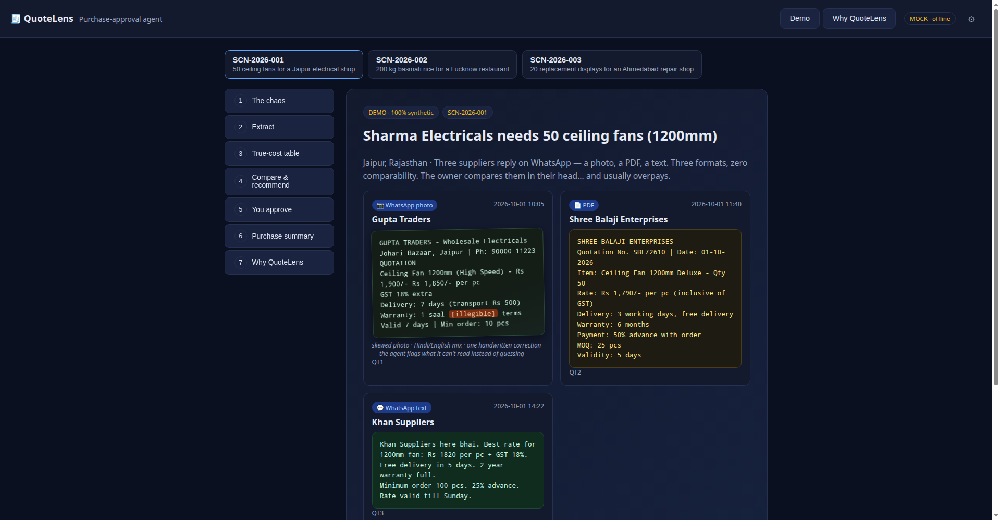
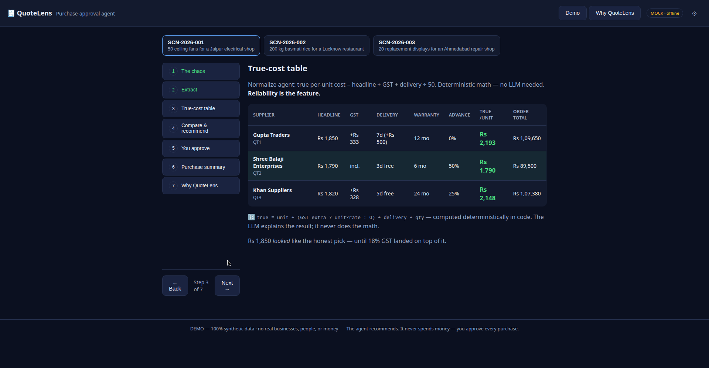
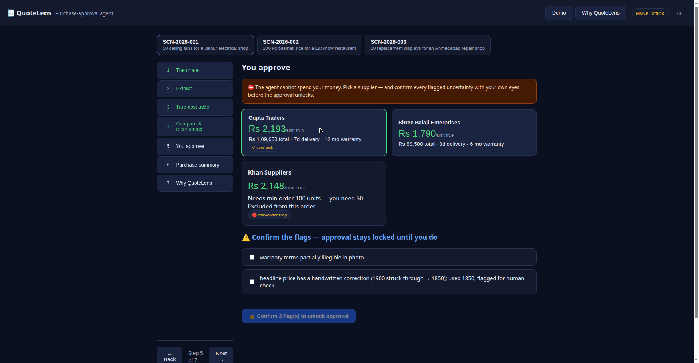
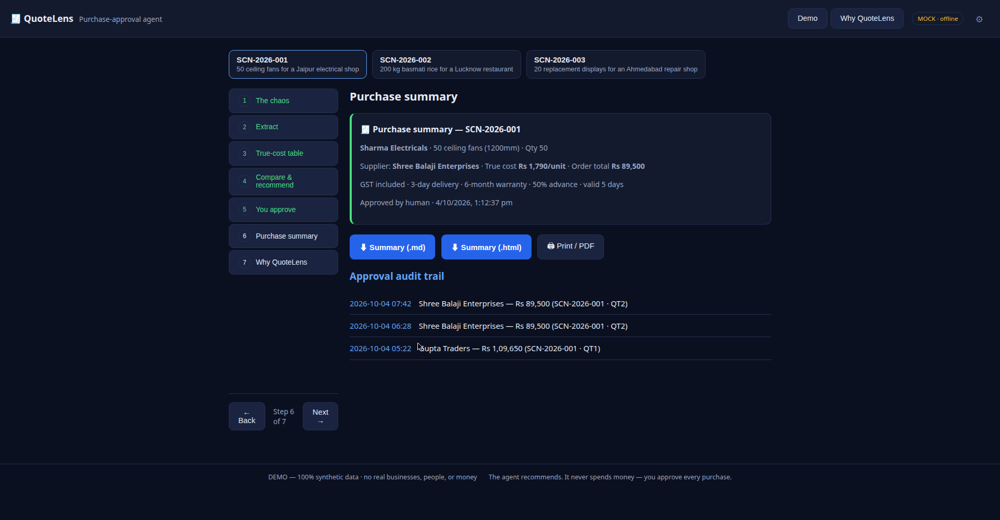

# QuoteLens � Purchase-approval agent for small businesses (WCC Launchpad 30)

Supplier quotes arrive as WhatsApp photos, PDFs, and text notes. Agents extract,
normalize, and compare them into one honest true-cost table � and the human approves
the spend. **Agents propose, humans dispose.**

**100% of demo data is synthetic.** No real businesses, people, or money.

**Live demo:** https://quotelens-xi.vercel.app/#/demo

## Run it

No build step. Serve the folder statically and open it:

```sh
# any static server, e.g.
npx serve .
# then open http://localhost:3000/#/demo
```

Or deploy to Vercel as a static site.

## Structure

```
index.html            shell + routes (#/demo, #/why) + settings
css/styles.css
js/main.js            router, boot, provider badge
js/ui/tour.js         the 7-step judge tour (chaos ? � ? human approval ? summary)
js/ui/export.js       purchase summary .md / .html / print-to-PDF
js/agents/pipeline.js 4-agent orchestration (extract ? normalize ? compare ? recommend)
js/ai/provider.js     pluggable AI: MockProvider (offline) | LLMProvider
js/data/quotes.js     synthetic purchasing scenarios (SCN-2026-001 �)
js/data/schema.md     the scenario JSON contract (for generating more)
```

## The demo scenarios

Three synthetic purchasing scenarios ship with the demo, messy on purpose:

- SCN-2026-001: 50 ceiling fans for Sharma Electricals (Jaipur). The cheapest headline (Rs 1,850) hides Rs 333/unit in GST. True costs: Rs 2,193 vs Rs 1,790 vs Rs 2,148 per unit. Winner: Shree Balaji Enterprises - saving Rs 403/unit, Rs 20,150 across the order.
- SCN-2026-002: 200 kg basmati rice. A pack-size trap: Rs 2,250 per 25 kg vs Rs 920 per 10 kg vs Rs 94/kg. True costs: Rs 102 vs Rs 91 vs Rs 97 per kg.
- SCN-2026-003: 20 phone display assemblies for BenchCraft Mobile Repairs (Ahmedabad). One quote is a degraded photo with an illegible warranty seal (flagged; approval locks until confirmed). The cheapest supplier (Rs 760/unit) is disqualified on MOQ (40 > 20). Winner: ClearView Components at Rs 820/unit.

The agents find it; the human decides. Three suppliers reply on WhatsApp �


## License

MIT - see [LICENSE](LICENSE).

## Roadmap

- Real WhatsApp intake: forward quotes to a number instead of pasting them in.
- Repeat-supplier memory: price history per supplier, so agents can flag when a quote drifts above past prices.
- One-click GST-ready summary export for the accountant.

## Screenshots



*Three supplier quotes arrive as a WhatsApp photo, a PDF, and a text message.*



*The normalize agent's apples-to-apples table � the Rs 1,850 headline hides Rs 333/unit in GST.*



*Approval stays locked until every flagged uncertainty is confirmed by eye.*



*Explicit human approval generates the purchase summary and audit log.*

## Real AI (optional, never required)

Settings ? paste an OpenAI-compatible `baseUrl` + `apiKey` + `model`.
Stored in `localStorage` only � never in the repo. If anything fails, the app
silently falls back to the offline mock provider, so the demo can never break live.

## Disclosure (per WCC Launchpad 30 rules)

This scaffold was prepared before the event as a template; the core product is built
during the official hackathon period (Oct 4�5, 2026). AI tools used: Muse (Meta) for
architecture/code, GPT-6 (Astra) for synthetic data and content.

